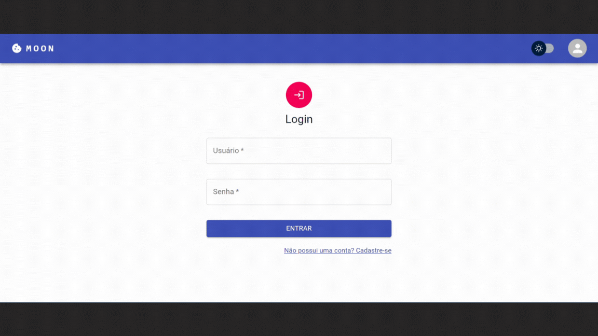

# Desafio Técnico - *Project Management*

## Boas vindas ao repositório do Desafio Técnico - Case da empresa J&A

Esse desafio foi proposto pela time de recrutamento da empresa J&A, em que foram requisitadas habilidades necessáiras para desenvolver um projeto **Full Stack**. O resultado final é uma plataforma para **organização e acompanhamento dos projetos** pelos usuários que se cadastram na plataforma, salvando dados num banco de dados **SQL** através de uma **API**.

---

## Sumário

- [Contexto do *Case*](#contexto-do-case)
  - [Requisitos técnicos](#requisitos-técnicos)
  - [Funcionalidades](#funcionalidades)
- [Entregáveis](#entregáveis)
- [Uso do projeto localmente](#uso-do-projeto-localmente)
- [Usando a plataforma](#usando-a-plataforma)
  - [Primeiro Acesso](#primeiro-acesso)
  - [Criando uma tarefa](#criando-uma-tarefa)
  - [Atualizando uma tarefa](#atualizando-uma-tarefa)
  - [Excluindo uma tarefa](#excluindo-uma-tarefa)
  - [Ordenando a Lista de Tarefas](#ordenando-a-lista-de-tarefas)
  - [Filtrar as tarefas](#filtrar-as-tarefas)
  - [Digitando a URL de forma errada](#digitando-a-url-de-forma-errada)
  - [Realizando o *Logout*](#realizando-o-logout)
  - [Acessando pelo celular](#acessando-pelo-celular)
---

## Contexto do *Case*

*"Nesse desafio, você deverá criar uma aplicação para nos mostrar suas skills e se elas estão de
acordo com o dia-a-dia do nosso time de desenvolvimento!"*

*"Essa será uma aplicação para gerenciar projetos. Será permitida a criação de um usuário com name,
password e username, bem como fazer o CRUD de projects"*

Abaixo estão os requisitos técnicos e as funcionalidades que a solução deve possuir:

### Requisitos técnicos

- [x] Front-End para uso do CRUD dos projetos na área logada;
- [x] Back-End em NodeJS ou Python com rotas especificadas;
- [x] Modalagem PostgreSQL;

### Funcionalidades

- [x] Listar todos os *projects*;
- [x] Alterar o *title* e *deadline* de um projeto existentes;
- [x] Marcar um *projeto* como feito;
- [x] Excluir um *projeto*;

## Entregáveis

A solução do desafio foi separarada em duas partes: front-end e back-end, cada em sua respectiva pasta com as seguintes tecnologias principais:

### Front-End
[React](https://reactjs.org/)<br>
[Typescript](https://www.typescriptlang.org/)<br>
[ReactHooksForms](hhttps://react-hook-form.com/)<br>
[MUI](https://mui.com/)<br>
[Jotai](https://jotai.org/)<br>
[ReactQuery](https://react-query-v3.tanstack.com/)<br>

### Back-End
[Nest](https://nestjs.com/)<br>
[Nodejs](https://nodejs.org/)<br>
[JWT](https://jwt.io/)<br>
[ClassValidator](https://github.com/typestack/class-validator)<br>
[GraphQL](https://graphql.org/)<br>

### Banco de Dados
[PostgreSQL](https://www.postgresql.org/)<br>

### Criação do Ambiente
[Docker](https://www.docker.com/)<br>


Gostaria de informar que me autodesafiei muito nesse case e quis desenvolve-lo com tecnologias em alta no mercado, algumas que até eu nunca tinha trabalhado antes como: Postgre, GraphQL, Rect Hooks Forms, Nestjs e Docker. Por estar atuando a muitos meses no front-end imaginei que iria sentir muita dificuldade na instalação, configuraçao e manipulação do Postgre, um SGBD que nunca havia trabalhado, mas utilizando o Docker consegui criar uma ambiente com tudo que eu precisava sem se quer ter que fazer as configurações manuais que levam tempo para os desenvolvedores inciarem de fato a programação dos seu apps no projeto. Acredito que o ponto alto foi de fato o Docker. Além de claro, o GraphQL que me ajudou a criar com um único end-point a API com tudo que eu precisava. 

---

## Uso do projeto localmente

Para facilitar o processo de rodar o projeto localmente. Recomendo seguir o passo a passo descrito a abaixo, após instalar o Docker e Docker Compose em seu notebook usando a própria documentação da ferramenta para o seu sistema operacional, em poucos passos você vai perceber que o projeto estará rodando em seu notebook com poucos comandos. É sensacional! Mas se preferir em cada pasta há um readme gerado pelas ferramentas pricipais que explica como manipular e instalar as dependências de cada pasta.

Vamos lá!

### Clone do repositório

1. Abra o terminal e crie um diretório no local de sua preferência com o comando **mkdir**:
```javascript
  mkdir desafio-jea
```

2. Entre no diretório que acabou de criar e depois clone o projeto:
```javascript
  cd desafio-jea
  git clone https://github.com/dudawiltiner/jea-technical-challenge.git
```

### Instalação das dependências

3. Entre no diretório criado após a clonagem do repositório.
```javascript
  cd jea-technical-challenge
```

4. Garanta de remover todas os containers, volumes e imagens que você possui.
```javascript
   docker-compose down -v --rmi all
```

5. Limpar tudo que ainda tiver.
```javascript
   docker system prune -af
```

6. Instale todas as dependências e rode a aplicação, usando o CLI **docker-compose**.
```javascript
   docker-compose up --build
```

## Usando a plataforma

Após cada um dos passos a seguir, haverá um exemplo de como cada página pode ser usada, caso tenha dificuldades e o exemplo não seja suficiente, não hesite em me contatar em _eduardawiltiner@gmail.com_.

### Primeiro Acesso

Acessando a plataforma neste [link](http://localhost:3000/), você irá encontrar a tela de **Login**, em que será redirecionado(a) e poderá realizar o cadastro na tela após clicar no link.

<div align="center">
  
</div>

### Login

Será onde você deverá se autenticar para ter acesso ao acompanhamento dos projetos na página **Home**. Sem a autenticação você não terá acesso a Home, mas quando autenticado(a) você não terá que fazer o *login* novamente quando fechar a página e abri-la depois durante 15 minutos, por conta do uso do JWT e cookies configurados.

<div align="center">
  
</div>

### Criando um projeto

Para criar uma tarefa, você deve apenas clicar no "+" do botão flutuante. Uma data de prazo já estará configurada para o mesmo dia de criação da tarefa, mas você pode modificá-la. Que tal colocar um darkmode?!

<div align="center">
  
</div>

### Atualizando um projeto

Para atualizar um projeto, você deve apenas clicar no símbolo de edição no card de cada projeto. E você pode também excluir ou clicar no check para mudar o status para *done*.

<div align="center">
  
</div>

### Filtrar os projetos

Você pode filtrar os projetos para aparecer apenas os que estão sob a sua responsabilidade.

<div align="center">
  
</div>

### Realizando o *Logout* e Digitando a URL de forma errada

Para se desconectar da sua conta, só é necessário clicar em seu nome no NavBar e, em seguida, clicar em "Sair". Ao digitar a URL do site de forma errada, não se preocupe, vai paracer a página de erro 404 que vai te ajudar a voltar a **Home**.

<div align="center">
  
</div>

### Documentação da API

Com o GraphQl temos como testar e olhar a documentação *playground* da ferramenta. Isso facilita com os testes e na tipagem acessando o seguinte [link](http://localhost:3001/graphql).

<div align="center">
  
</div>
